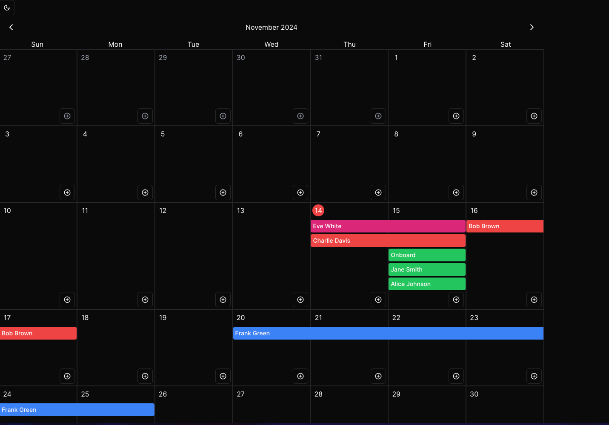

# Full calendar ShadCn
The FullCalendar component provides a grid-based monthly calendar view that displays events and allows users to navigate between months, select dates, and add events. It includes a tooltip feature to show detailed event information on hover, as well as customizable event colors.

Key Features
- Monthly Navigation: Easily move between months using header controls.
- Event Display with Tooltips: Show events in calendar cells with tooltips displaying additional information, including titles, dates, participants, and pricing (if available).
- Color Customization: Customize event colors using Tailwind color classes for the event background.
- Dynamic Event Spanning: Events spanning multiple days are displayed without borders disrupting continuity.
- Selectable Dates: Highlights the selected date and today’s date for easy reference.
- Add Event Button: Easily add new events to any day using the button in each cell.


### Event props
```typescript
interface FullCalendarEvent {
  title: string;
  details?: string;
  person?: [
    {
      name: string;
      role: string;
    },
  ];
  date: { start: Date; end: Date };
  price?: {
    value: number;
    currency: string;
  };
  colors: {
    background: Color;
  };
}
```

### Usage example

```tsx
import {EventsMock} from "src/events.mock";

function Example() {
  const [events, setEvents] = useState(EventsMock)
  return (
    <div className="w-full md:w-[1280px]">
      <FullCalendarProvider
        events={EventsMock}
        onClickEvent={(event) => console.log(event)}
        handleClickAddEvent={(selectedDay) => setEvents([...events, {
            title: 'test',
            date: { start:selectedDay, end: selectedDay},
            colors: { background: 'blue-500'},
            details: 'example'
          }]
        )}
      >
        <FullCalendarHeader/>
        <FullCalendarHeaderDays/>
        <FullCalendarDaysCells/>
      </FullCalendarProvider>
    </div>
  );
}
```




